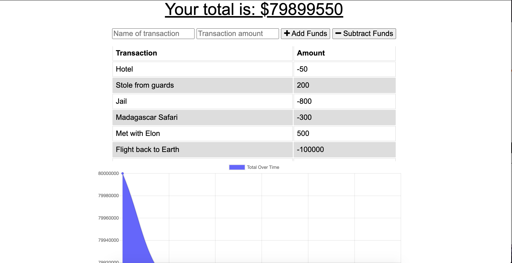
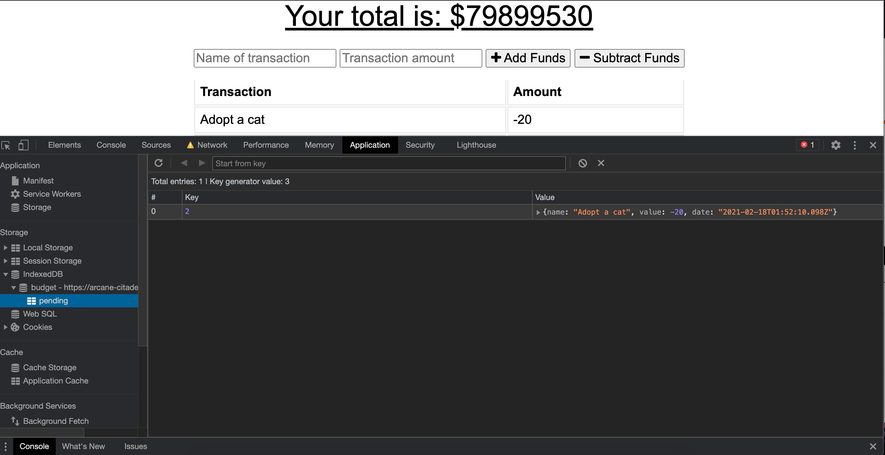

# Budget Tracker 

  ## Description
  Track your withdrawls and deposits with or without internet connection!
  When entering transactions offline, it will populate the total when brought back online. 
  
  ## Table of Contents 
  
  * [App](#app)
  * [Installation](#installation)
  
  * [Usage](#usage)
  
  * [Tests](#tests)
  
  * [Screenshots](#screeshots)

   ## App

Deployed on Heroku
[BudgetTracker](https://arcane-citadel-77897.herokuapp.com/)

  
  ## Installation
  
  To install necessary dependencies, run the following command:
  
  ```
  npm i
  ```
  
  ## Usage
  ```
  Enter a transaction, transaction amount and add the fund or subtract the fund.
  ```


  ## Tests
  ```
  node server.js 

  ```

  
## Screenshots
  


  
  